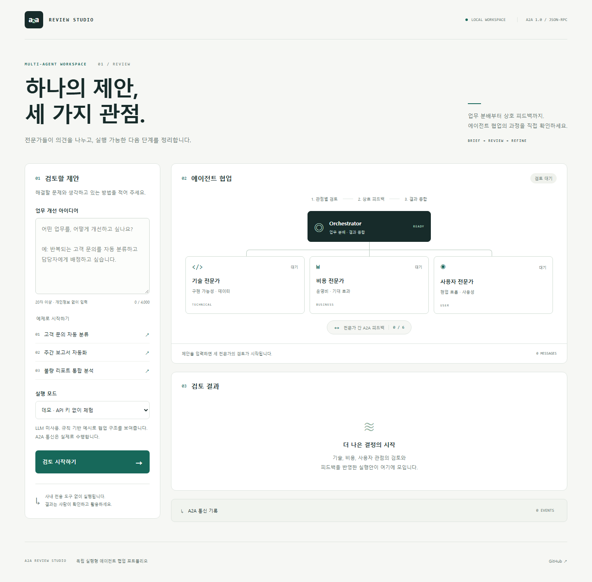
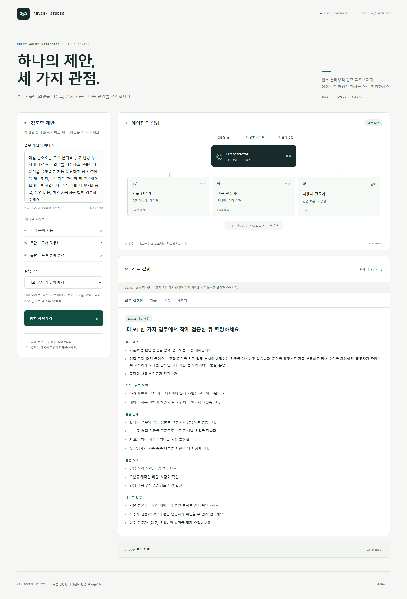
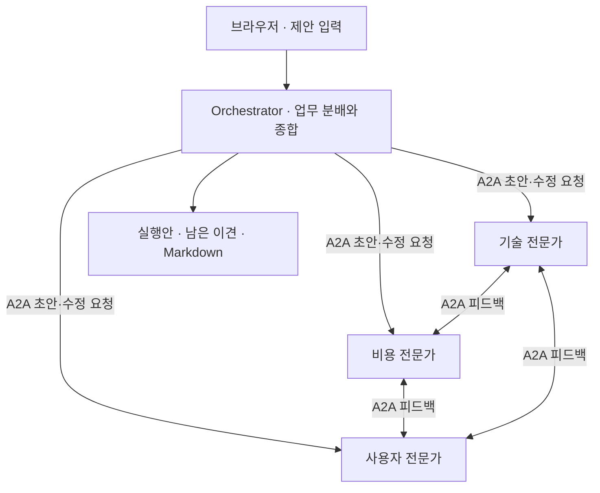

# A2A Review Studio

**하나의 업무 개선안을 기술·비용·사용자 관점에서 검토하고, 전문가 간 피드백을 확인하는 웹앱.**

[](https://github.com/seokbeomkong/a2a-review-studio/actions/workflows/ci.yml)



Orchestrator가 세 전문가에게 검토를 요청하고, 전문가들이 서로 A2A 메시지를 보내 초안을 개선합니다. 최종 실행안뿐 아니라 **누가 누구에게 무엇을 요청했고, 어떤 응답으로 의견을 수정했는지** 확인할 수 있습니다.

> **기본 모드는 데모입니다.** 실제 A2A HTTP 통신을 수행하지만, 답변은 규칙 기반 예시이며 LLM을 호출하지 않습니다. Claude 모드는 서버에 API 키와 모델을 설정하면 사용할 수 있습니다. 이 저장소의 검증에는 실제 유료 Claude 호출이 포함되지 않았습니다.

## 실행하기

Python 3.12 이상. H-Chat, 사내 전용 API, 데이터베이스, Node.js 빌드가 필요하지 않습니다.

```bash
git clone https://github.com/seokbeomkong/a2a-review-studio.git
cd a2a-review-studio
uv sync --frozen
uv run python -m review_studio
```

브라우저에서 **http://127.0.0.1:8765** 를 엽니다. 예제를 선택하고 **검토 시작하기**를 누르면 됩니다.

`uv`가 없다면:

```bash
python -m venv .venv
# Windows: .venv\Scripts\activate
# macOS/Linux: source .venv/bin/activate
python -m pip install -e .
python -m review_studio
```

서버를 실행한 터미널에서 `Ctrl+C`로 종료합니다. 다른 포트를 사용하려면 `.env`에서 `STUDIO_PORT`를 설정하세요. 서버는 **127.0.0.1에만 바인딩**됩니다.

## 무엇을 확인할 수 있나요?

| 단계 | 동작 | 확인할 결과 |
|---|---|---|
| 1. 관점별 검토 | Orchestrator → 전문가 3명 | 기술·비용·사용자 초안 |
| 2. 상호 피드백 | 각 전문가 → 다른 전문가 2명 | 총 6건의 의견 교환 |
| 3. 수정 | 각 전문가가 받은 피드백 반영 | 초안과 수정안, 반영 내역 비교 |
| 4. 종합 | Orchestrator가 결과 정리 | 실행 단계, 검증 지표, 남은 이견 |
| 5. 내보내기 | 검토 결과 다운로드 | [Markdown 결과 예시](docs/sample-report.md) |

정상 실행에서는 **A2A 요청 12건, 요청·응답 이벤트 24건**이 기록됩니다. 전문가의 초안 검토 3건, 수정 요청 3건, 수정 중 전문가 간 피드백 6건입니다. Claude 모드의 최종 종합은 Orchestrator 내부 모델 호출이므로 A2A 요청 수에 포함하지 않습니다.



## 실제 A2A와 단순 함수 호출의 차이

이 앱은 Python 함수 간 호출을 A2A로 표시하지 않습니다. 공식 `a2a-sdk==1.1.5` 클라이언트와 서버가 **A2A 1.0 JSON-RPC `SendMessage`** 를 실제 HTTP로 교환합니다.



- 각 전문가가 고유 Agent Card와 엔드포인트를 제공합니다.
- 한 프로세스에 배치하되 **루프백 HTTP 경계**를 통과합니다. 분산 서비스 운영 실적을 주장하는 프로젝트는 아닙니다.
- 에이전트 간 메시지의 내용은 이 앱의 `AgentJob` JSON 계약을 텍스트 파트로 전달합니다. A2A가 연결된 모든 외부 에이전트의 업무 형식까지 자동으로 통일해 주는 것은 아닙니다.
- 모든 전문가를 호출하는 **정해진 순서의 오케스트레이션**입니다. 모델이 임의로 에이전트를 생성하거나 무제한 토론을 실행하지 않습니다.
- 공식 SDK를 사용하며, 이 구현은 **FastA2A·Deep Agents·MCP를 사용하지 않습니다.** 교안에서 익힌 협업 개념을 독립적인 SDK 구현으로 구성했습니다.

## Claude 모드

`.env.example`을 `.env`로 복사하고 로컬에서 값을 설정합니다.

```dotenv
ANTHROPIC_API_KEY=여기에_본인_API_키
CLAUDE_MODEL=계정에서_사용_가능한_모델_ID
STUDIO_PORT=8765
```

서버를 재시작하면 실행 모드에서 Claude API를 선택할 수 있습니다. 모델 ID는 계정의 사용 가능 목록을 확인해 입력하세요. 특정 모델을 임의로 가정하지 않습니다.

- Claude 웹/Code 구독과 별도로 **Anthropic API 사용 권한과 요금**이 필요합니다.
- 정상 검토 1회는 최대 **13회의 모델 생성 요청**으로 구성됩니다. 각 요청의 출력 상한은 1,600토큰이며 입력 비용도 별도로 발생합니다. 자동 재시도는 하지 않습니다.
- 입력한 제안과 전문가 메시지는 Anthropic API로 전송됩니다. 공개해도 되는 샘플로 먼저 확인하세요.
- API 키는 서버에서만 사용하고, 브라우저·검토 결과·Git에 기록하지 않습니다.
- 호출·응답 형식 오류가 발생하면 누락이나 실패로 표시합니다. **데모 응답으로 조용히 대체하지 않습니다.**

## 검증과 실행 범위

```bash
uv sync --frozen --extra dev
uv run pytest -q
uv run ruff check .
uv run ruff format --check .
```

테스트는 실제 로컬 Uvicorn 서버와 공식 A2A SDK를 사용합니다. 모델 API는 별도의 HTTP 응답 fixture로 검사하며 실제 Claude 호출을 흉내 낸 테스트를 실제 모델 검증으로 계산하지 않습니다.

브라우저 검증은 서버를 별도 터미널에서 실행한 뒤:

```bash
uv sync --frozen --extra dev --extra browser
uv run playwright install chromium
uv run python scripts/browser_smoke.py
```

입력·완료·피드백 비교·키보드 탭 전환·내보내기·실제 통신 기록·HTML 주입 방지·새로고침 복구·390px 레이아웃을 확인합니다. 스크린샷과 예시 보고서는 이 스크립트가 생성한 실제 데모 결과입니다.

실행 한도는 4개 동시 검토, 180초 실행 제한, 최대 50개 결과, 1시간 보관입니다. 데이터는 메모리에만 보관하며 서버 재시작 시 사라집니다. 시간 초과·일부 장애 시 이미 받은 검토는 남기고 누락을 표시합니다. 합의에 이르렀다는 보장을 하지 않습니다.

이 앱은 **단일 사용자 로컬 포트폴리오**입니다. 내부 에이전트 호출에는 프로세스별 키를 사용하고 외부 Origin·Host를 차단하지만, 사용자 로그인·테넌트 권한·외부 배포 인증·영구 저장소는 구현하지 않았습니다. `--host 0.0.0.0`, 공개 프록시 또는 다중 worker 운영용으로 설계하지 않았습니다.

## 코드 살펴보기

```text
review_studio/
  models.py       입력·검토 결과·에이전트 작업 계약
  providers.py    규칙 기반 데모와 Claude Messages API
  protocol.py     Agent Card, SDK 서버, 실제 HTTP 클라이언트
  runs.py         단계별 실행, 제한, 상태·통신 기록, Markdown
  app.py          로컬 접근 경계와 REST API
  static/         반응형 한국어 UI
tests/            입력·모델 경계·A2A 네트워크 통합 테스트
scripts/          브라우저 검증
docs/             구조, 검증 기록, 스크린샷, 사용자 검토 가이드
```

- [처음 검토할 항목](docs/review-guide.md)
- [구조와 프로토콜 범위](docs/architecture.md)
- [검증 기록과 한계](docs/verification.md)
- [모바일 화면](docs/screenshots/mobile.png)

## 포트폴리오에서 설명할 수 있는 내용

> AI 코딩 도구를 활용해 A2A 기반 업무 개선안 검토 웹앱을 제작했습니다. Orchestrator가 세 전문 에이전트에게 업무를 분배하고, 에이전트들이 실제 HTTP 메시지로 피드백을 교환하는 흐름을 구현했습니다. 요청·응답과 초안 수정 내역을 확인할 수 있게 구성하고, 일부 에이전트의 실패·시간 초과·동시 실행을 검증했습니다.

직접 코드를 실행하고 구조를 이해한 뒤 본인의 실제 기여 범위에 맞춰 사용하세요. 운영 성과나 비용 절감 수치는 측정하지 않았습니다.

## 참고 문서

- [공식 A2A Python SDK](https://github.com/a2aproject/a2a-python)
- [A2A 1.0 명세](https://a2a-protocol.org/v1.0.0/specification/)
- [Claude Messages API](https://platform.claude.com/docs/en/api/messages/create)

코드·화면·샘플 제안은 이 프로젝트용으로 작성했습니다. 회사 교안 원본이나 사내 전용 프로그램은 포함하지 않습니다.

